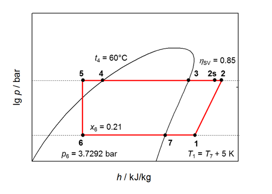
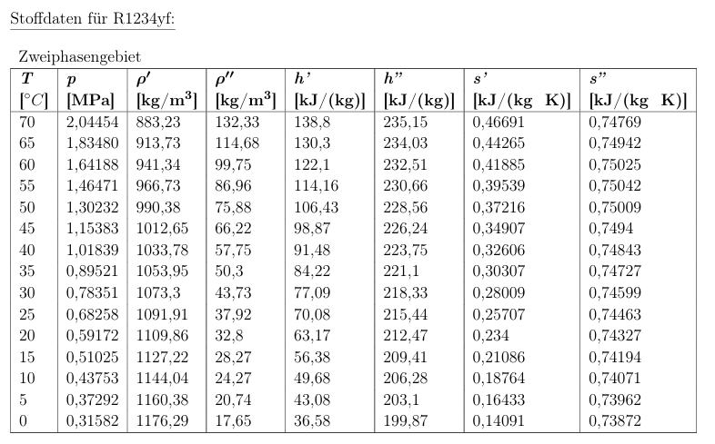
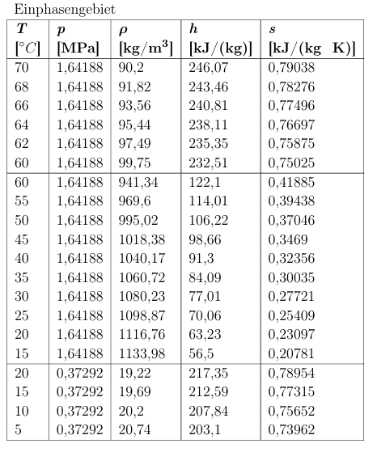

Aufgabe 9.2 Kompressionskältemaschine

In einer Industrie-Kompressionskältemaschine mit dem Kältemittel R1234yf werden die im untenstehenden lg p,h-Diagramm skizzierten Zustandsänderungen durchlaufen.

a)

1 -> 2: Kompression des überhitzten Dampfes mit einem isentrop Wirkungsgrad von η_s,V=0,85

2 -> 3: Isobar abkühkung bis TL

3 -> 4: Isobar Kondensation bis SL mit t_4 = 60

4 -> 5: Isobar unterkühlung

5 -> 6: adiabate Drosselung bis auf p_6

6 -> 7: Isobar verdampfung bis TL

7 -> 1: Isobar überhitzung um 5K

b)

